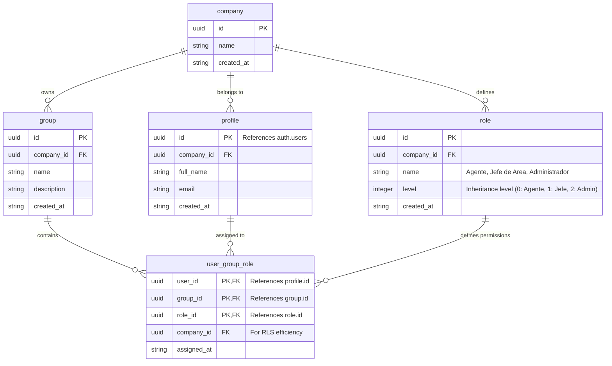

# Multi-tenant Groups and Roles Model - HU-2

## 1. Entity-Relationship Diagram (Mermaid)

## 2. Decisiones de Diseño del Modelo de Datos

- **Multi-tenancy (Multitenencia)**: Todas las tablas contienen la columna `company_id`. Esto permite implementar políticas de Seguridad a Nivel de Fila (RLS) simples y eficientes.
- **Integración de Autenticación**: Estoy utilizando una tabla de `profiles` (perfiles) que se vincula con `auth.users` de Supabase. Este es el patrón estándar recomendado por Supabase.
- **Herencia de Roles**: En lugar de utilizar una tabla compleja de autorreferencia, estoy usando un entero de `level` (nivel).
    - `Agente`: Nivel 0
    - `Jefe de Área`: Nivel 1 (hereda del Nivel 0)
    - `Administrador`: Nivel 2 (hereda del Nivel 1)
- **Relación Usuario-Grupo-Rol**: Un usuario puede pertenecer a múltiples grupos y, en cada grupo, tiene asignado un rol específico.

## 3. DDL de SQL Detallado y Políticas RLS

El siguiente script incluye las tablas, restricciones, políticas RLS e índices.
